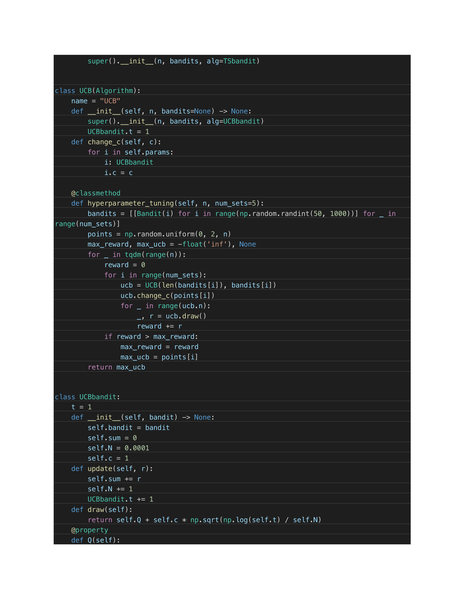

# Extended-Essay

The focus of this essay is to investigate computational complexities and regrets of
algorithms addressing the Multi-Armed Bandit Problem (MAPB), a famous problem for
analyzing the exploration-exploitation tradeoff. Today, the exploration-exploitation tradeoff
dilemma is present in many settings, such as online advertising, healthcare, and finance (A
Survey on Practical Applications). This essay will specifically look into Thompson Sampling
(TS) and Upper Confidence Bound (UCB) algorithms. These algorithms would be investigated
in terms of time complexity––the time taken for an algorithm to run given a set of input values of
a certain size––and the total expected regret––the difference between rewards yielded from the
optimal action and from the chosen action. Hence, the question: “How does the performance of
Thompson Sampling compare to that of the Upper Confidence Bound Algorithm in terms of time
complexity and regret?”

Full essay can be found in EE.pdf

## How to run

The experiments were ran in newmain.ipynb and the data are saved into time.csv and regret.csv

Implementations of Thompson Sampling, UCB, and the bandits could be found in Model.py

